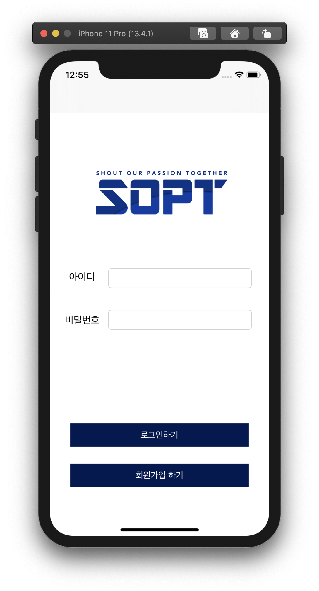
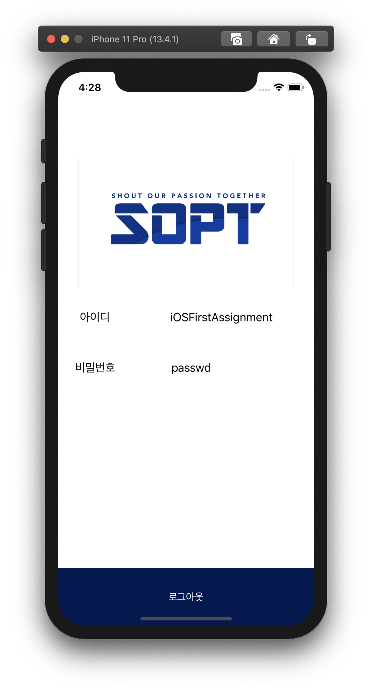

# LeeSeungho 🎉

## 🟢 1차 세미나 🟢

- VC (ViewController)간 데이터 전송하기

```swift
 guard let loginVC = self.storyboard?.instantiateViewController(identifier: "loginVC") as? loginVC else { return }
```

위와 같이 선언 후 VC2를 다루어야 합니다.

- ViewController 표현 방식 -
  present( Modal ), Push( Navigation )을 주로 사용 </br>

Present

```swift
        self.present(loginVC, animated: true, completion: nil)
```

Push

```swift
        self.navigationController?.pushViewController(signUpVC, animated: true)
```

Push는 NavigationController가 없는 경우 사용할 수 없습니다.

---

## 🟢 1차 과제 🟢

VC1 --- **_push_** ---> VC2 --- **_present_** ---> VC3 </br>

> dismiss : 모달로 주어진 뷰컨트롤러를 삭제할 수 있습니다.</br> 따라서 과제와 같이 Push - Present로 이어진 흐름은 일반적으로 한번에 삭제할 수 없습니다.

</br>

- 방법 1.
  RootViewController 수정하기(1) </br>

VC3은 VC2를 Root로 가지기 때문에, dismiss할 경우 VC2로 되돌아가게 됩니다. </br>
따라서, 다음과 같이 `RootViewController`를 수정해 줍니다.

```swift

    guard let firstVC = self.storyboard?.instantiateViewController(identifier: "NaviController")
    else { return }

       self.view.window!.rootViewController = firstVC
       dismiss(animated: true, completion: nil)

```

> 단점 : Animation이 없다. 안먹어요.

  </br>

- 방법 2.
  RootViewController 수정하기(2) </br>

```swift

dismiss(animated: true) {
        if let sceneDelegate = UIApplication.shared.delegate as? AppDelegate {
                (sceneDelegate.window?.rootViewController as? UINavigationController)?.popViewController(animated: true)
            }
        }

```

<center>




</center>
