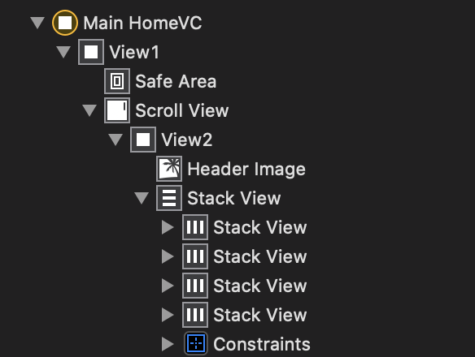
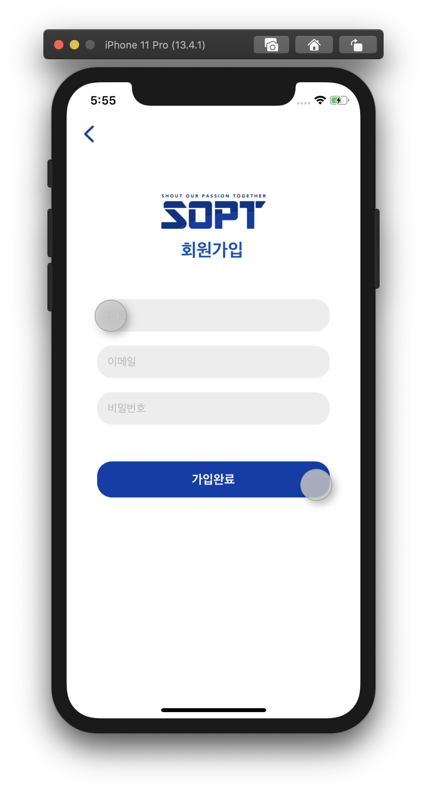
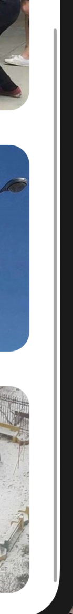
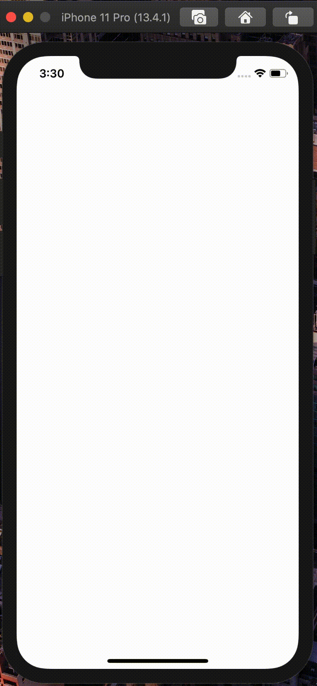
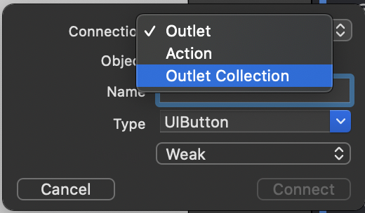
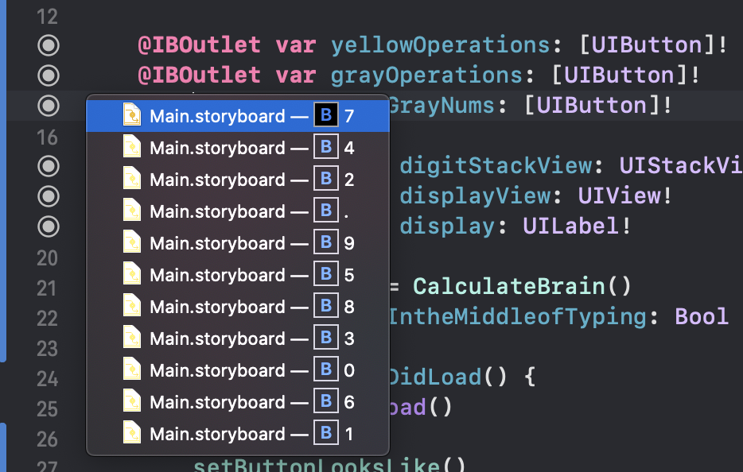
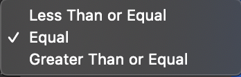

## 🟢 2차 과제 - ScrollView 그리기 + 도전과제 🟢

- 실행 gif


ScrollView + StackView 구조입니다. </br>

 </br>

**_Tips : `ScrollView`는 AutoLayout이 까다롭습니다. </br>
`StackView`를 이용하면 오토레이아웃에 도움을 받을 수 있습니다._**

### **도전 과제**

- Tips(1) : 스토리보드로도 (제한적으로) 구현할 수 있습니다!</br>
  Header Image의 *Top Constraint*를 최상위 View에 걸어야 합니다.
  </br>

  > https://codentrick.com/parallax-effect-for-ios-with-swift-part-2/ </br>

- Tips(2) : NavigationBar와 View 영역의 구분을 없애는 방법

사진과 같이 `NavigationBar` 영역과 `View` 영역의 구분을 없앨 수 있습니다.
 </br>

코드는 다음과 같습니다.

```swift
        guard let navigationBar = self.navigationController?.navigationBar else { return }

        navigationBar.isTranslucent = false
        navigationBar.backgroundColor = UIColor.clear
        navigationBar.setBackgroundImage(UIImage(), for: UIBarMetrics.default)
        navigationBar.shadowImage = UIImage()
```

`ViewDidLoad()`에 적용시켜 줍니다.

### ✏️ 구현 방법 : `Scrollview Delegate`를 이용해서 Header Image의 Height를 수정하기

1. Outlet으로 ScrollView를 선언합니다.
2. `ViewDidLoad()`에 해당 코드 두줄을 선언합니다.

```swift
override func viewDidLoad() {
        super.viewDidLoad()

        mainScrollView.delegate = self
        mainScrollView.contentInsetAdjustmentBehavior = .never
    }
```

(1) delegate : 다른 객체의 행동에 변화를 줄 수 있는 개체. </br> 코드로 ScrollView를 수정해 줄 것이므로 delegate 선언을 해 줍니다.</br>
(2) ScrollView 내부의 ContentArea를 자동으로 수정해주는 속성입니다. 디폴트는 `.Automatic`이지만, 코드로 레이아웃을 수정해야 할 때는 해당 속성을 `.never`로 변경해주어야 합니다.
</br>

```swift
extension MainHomeVC: UIScrollViewDelegate {
    func scrollViewDidScroll(_ scrollView: UIScrollView) {

        if scrollView.contentOffset.y < 0 {
            headerImageHeightConstraint.constant =
                originHeaderImageHeight - scrollView.contentOffset.y
        } else {
            var height = originHeaderImageHeight - scrollView.contentOffset.y
            height = height > minimunImageHeight ? height : minimunImageHeight
            headerImageHeightConstraint.constant = height
        }
    }
}
```

> (1) `func scrollViewDidScroll(_ scrollView: UIScrollView)` : </br>
> Scroll이 시작될 때 호출되는 함수입니다. 매 스크롤마다 호출됩니다. </br></br>
> (2) `scrollView.contentOffset.y` : </br> >  </br>
> 그림에서 회색 스크롤이라고 생각하면 좋습니다. 스크롤을 내릴수록 +, 올릴수록 -의 값을 리턴합니다.

따라서, `contentOffset`이 음수일 경우는 이미지의 사이즈를 크게, </br>
`contentOffset`이 양수일때는 이미지의 사이즈를 작게 해 주어야 합니다.

---

## 🟢 2차 추가 과제 - 계산기 🟢

- 실행 gif



### 1. StackView 구조 만들기

전체적인 StackView 구조를 먼저 만들어야 합니다. 전체 View Size를 7등분하여 사용하였습니다.
</br>

1 - 빈 StackView</br>
2 - UILabel StackView</br>
3 - Button</br>
4 - Button</br>
5 - Button</br>
6 - Button</br>
7 - Button</br>

1부터 7은 Horizontal Stack View, 그리고 이들을 감싸는 가장 큰 Vertical StackView 1개로
구성하였습니다. </br>

- Horizontal StackView </br>

각 버튼은 Equal Width 속성을 가지고 있습니다.

- Vertical StackView

각 StackView는 Equal Height 속성을 가지고 있습니다.</br>
만약 추가적인 높이 조절이 필요할 때는 `Multiplier`를 수정하여 높이 조절을 할 수 있습니다. </br>

### 2. 버튼 모양 세팅하기

Button이 여러개일 때는 Outlet Collections를 사용하는것이 좋습니다. </br>
실행 방법은 다음과 같습니다.

<center>
 
</center>
</br>
button의 Outlet을 설정해준 뒤에는 버튼의 모양을 설정해주어야 합니다.</br>
우측의 Attribute Inspector 창에서 설정해줄 수 있습니다. 코드로는 다음과 같이 설정해 줄 수 있습니다.

```swift
func setButtonLooksLike() {
        digitStackView.backgroundColor = .black
        displayView.backgroundColor = .black
        view.backgroundColor = .black

        for i in 0..<yellowOperations.count {
            let bt: UIButton = {
                let btn = yellowOperations[i]
                btn.titleLabel?.font = UIFont.systemFont(ofSize: 40)
                btn.setTitleColor(.white, for: .normal)
                btn.layer.cornerRadius = btn.frame.height/2
                btn.layer.borderWidth = 1
                btn.layer.borderColor = UIColor.clear.cgColor
                btn.clipsToBounds = true
                btn.backgroundColor = UIColor.calculatorColor(.orangeColor)

                return btn
            }()
        }
```

1. swift에서 `for ~ in ~` 의 형태는 위와 같습니다.
2. `btn.layer.cornerRadius` ~~~ `btn.clipsToBounds = true` : 해당 뷰를 원처럼 만들어 줍니다.

### 3. 필요한 AutoLayout 잡기

- UILabel AutoLayout

2번째 Horizontal StackView에는 UILabel이 있는데, 이는 기본적으로 오른쪽 정렬이여야 합니다. </br>
또한, 오른쪽에서 왼쪽으로 숫자가 쌓이며 커지는 형태이므로,
**LeftAnchor의 값은 계속 변해야 합니다.**

숫자가 계속 입력됨에 따라 -

> `LeftAnchor`----- **감소** ----- `UILabel` ----- **_0으로 유지_** ----- `RightAnchor`

이는 Constraint에서 Relation의 특성을 보아야 합니다.



왼쪽 Constraint의 숫자는 점점 작아져야 하므로, </br>
Less Than or Equal으로 설정하면 Constraint 값보다 유동적으로 작아지게 됩니다.

코드로 설정하면 다음과 같습니다.

```swift
        let constraints = [
            display.leftAnchor.constraint(lessThanOrEqualTo: displayView.leftAnchor, constant: 320),
            display.rightAnchor.constraint(equalTo: displayView .rightAnchor, constant: 0),
            display.bottomAnchor.constraint(equalTo: displayView.bottomAnchor, constant: 10)
        ]
        NSLayoutConstraint.activate(constraints)
```

> 이상입니다. 감사합니다~! 😊 </br>
> 계산기 로직은 필요하신 경우 클론해서 쓰세요!
