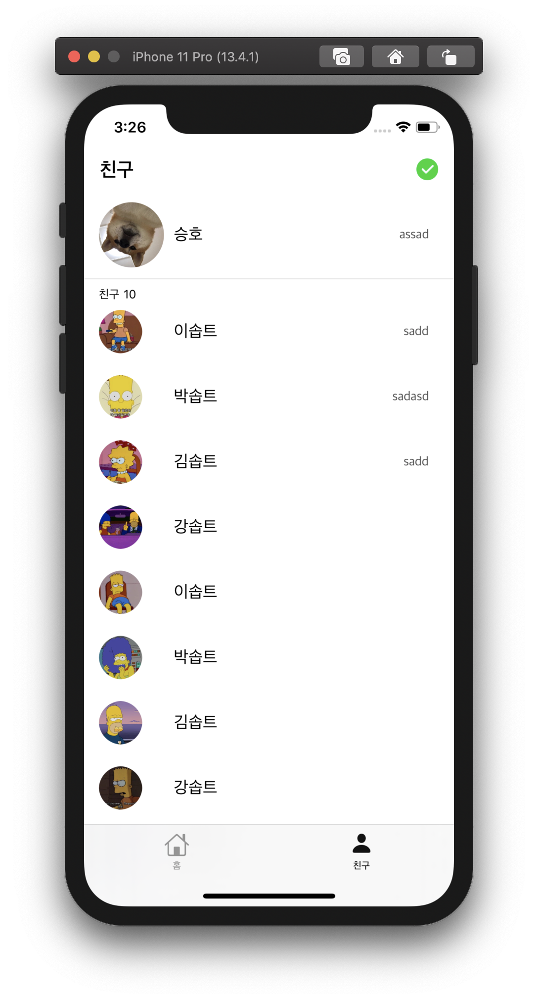
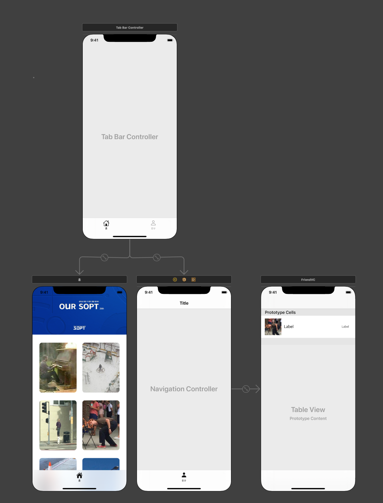
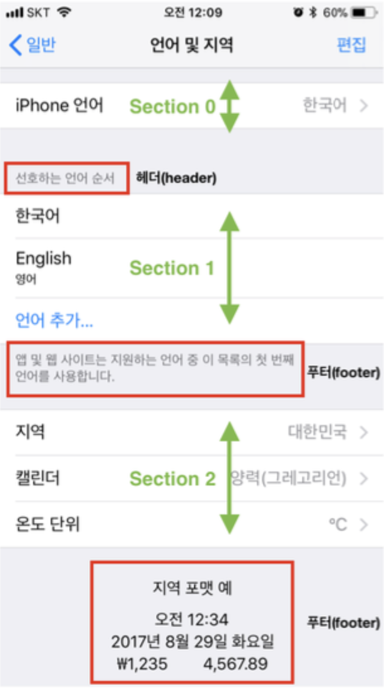
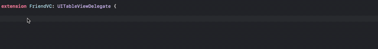

# - StackView, CollectionView 🎉

## 🟢 3차 과제 - Kakaotalk Home + 도전과제 🟢

실행 gif, main Home

 </br>

- 1. NavigationBar 영역 </br>
- 2. TableView 영역 - tableView는 MyProfile과 Friends로 구성됩니다.
- 3. TableView의 Header 영역을 사용해서 `친구 *명`을 표시할 것입니다.

스토리보드의 구조는 다음과 같습니다.
 </br></br>

#### **잠시 복습하는 TableView의 구조**

 </br>
주목할 포인트는 다음과 같습니다.
⭕️`indexPath.section()`과 `indexPath.row()`의 차이
⭕️`HeaderView()`와 `FooterView()`의 위치

</br>

## **✏️ 3차 과제 ✏️**

### - 1. tableView의 Section은 2개입니다. </br>

1 - My Profile, 2 - Friends Profile
`TableViewCell()`을 2개를 사용해도 좋지만, Myfrofile과 FriendsProfile의 형태가 유사하므로 재활용하여 사용했습니다. <br><br>

방법은 다음과 같았습니다.

```swift
    func tableView(_ tableView: UITableView, cellForRowAt indexPath: IndexPath) -> UITableViewCell {

    guard let cell = tableView.dequeueReusableCell(withIdentifier: "ProfileCell", for: indexPath) as? ProfileCell  else { return UITableViewCell() }

    if indexPath.section == 0 {
        cell.settings(friends[0])
        cell.profileImage.layer.cornerRadius = cell.profileImage.frame.height/2

        return cell
    } else {
        cell.settings(friends[indexPath.item+1])

        return cell
    }
}
```

- cell이 선언되었고, `indexPath.section()`의 값에 따라 cell은 다르게 리턴이 될 것입니다.
  `indexPath.section == 0`인 경우는 MyProfile,
  `indexPath.section == 1`인 경우는 FriendsProfile이 될 것입니다. </br></br>

- 다음, section 1과 section 2는 높이가 다릅니다.

```swift
func tableView(_ tableView: UITableView, heightForRowAt indexPath: IndexPath) -> CGFloat {
        if indexPath.section == 0 {
            return 88
        } else {
            return 66
        }
    }
```

위와 같이 `heightForRowAt`을 리턴해주는 함수를 선언해서 사용합니다. <br><br>

> **⭕️ Tips**<br>
> Q. tableView의 Delegate, Datasource에는 어떤 것이 있는지 어떻게 알아서 쓰느냐?
> A. 기본적으로 많이 해보는 방법이 필요합니다. 다만, 필요한 함수 대부분은 Delegate와 DataSource에 정의가 되어 있다는것을 기억하셔야 합니다. 찾아서 써야 해요!<br>
> A. 자동완성을 적극적으로 활용합시다! `func table~` 정도만 타아핑 한 후 원하는 함수를 검색할 수 있습니다!
> 키워드를 생각하며 자동완성 예 :
>  <br>
> 또한 애플 공식문서 > https://developer.apple.com/documentation 에 상세히 기재되어 있습니다! 파파고와 함께 하세요~!

### - 2. tableView Header를 사용해 보았습니다.

`tableView Header`는 따로 `Storyboard`에 정의되어 있지 않습니다.
UIView를 이용하여 만들거나, 코드로 만들어 주어야 합니다.

> Storyboard 또는 code를 이용해서 Header, FooterView 만들기
> https://programmingwithswift.com/how-to-add-header-footer-view-in-uitableview-in-storyboard/

- 코드로 선언해 보겠습니다!

```swift
  func tableView(_ tableView: UITableView, heightForHeaderInSection section: Int) -> CGFloat {

        if section == 0 {
            return 0
        } else {
            return 20
        }
    }
```

위와 같이 `Section 0`에는 헤더가 없고, `Section 1`에는 헤더 사이즈를 주었습니다.
따라서, `Section 1`의 위에만 헤더뷰가 그려질 것입니다. <br><br>

```swift

 func tableView(_ tableView: UITableView, viewForHeaderInSection section: Int) -> UIView? {

        let view = UIView.init(frame: CGRect(x: 0, y: 0, width: tableView.frame.width, height: 30))

        let headerLabel = UILabel()
        let numberOfFriendLabel = UILabel()

        headerLabel.text = "친구 "
        headerLabel.font = UIFont.systemFont(ofSize: 12)
        headerLabel.frame = CGRect.init(x: 15, y: 0, width: 50, height: 30)

        numberOfFriendLabel.text = "\(friends.count-1)"
        numberOfFriendLabel.font = UIFont.systemFont(ofSize: 12)
        numberOfFriendLabel.frame = CGRect.init(x: 40, y: 0, width: 50, height: 30)

        view.addSubview(headerLabel)
        view.addSubview(numberOfFriendLabel)

        return view
    }
```

함수명에서 알수있듯 *각 Section의 Header를 위한 View*라는 것을 알 수 있고, `UIView`를 리턴하는 함수입니다.

1. `view`의 사이즈를 설정해줍니다.
2. `numberOfFriendLabel`은 친구의 숫자입니다. `friends`배열의 숫자 -1(MyProfile) 만큼을 가지게 됩니다.
3. `addSubView()` 함수로 라벨을 추가해 줍니다.

준비가 끝났습니다. `AutoLayout`, 구조체 등을 설정한 뒤 실행해주면 원하는 화면을 얻을 수 있습니다.

## **✏️ 3차 도전 과제 ✏️**

필요한 것 :
(1) `UIAlertController()`,
(2) `func tableView(_ tableView: UITableView, commit editingStyle: UITableViewCell.EditingStyle, forRowAt indexPath: IndexPath) { }`

#### (1) `UIAlertController()`

아래에서 토글되며 나타나는 액션입니다.
