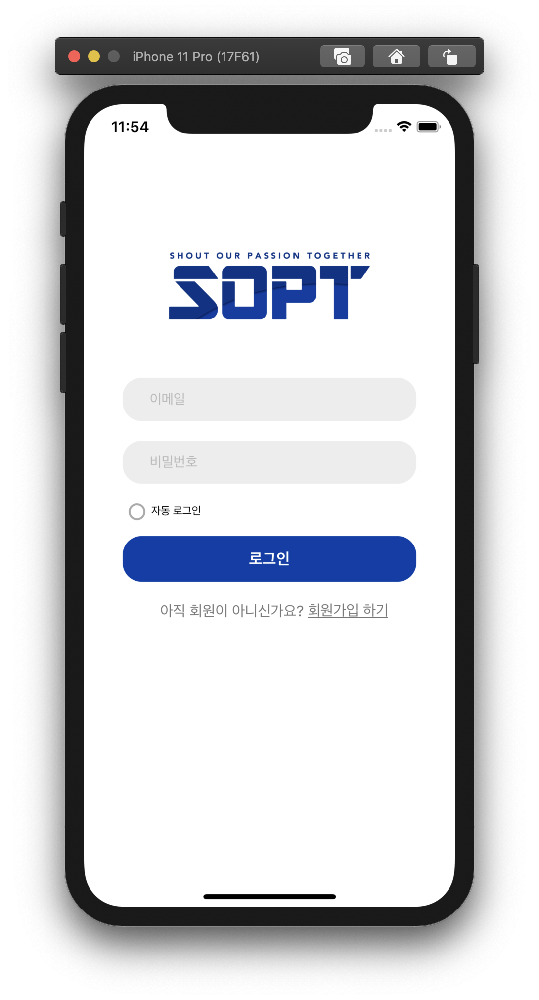
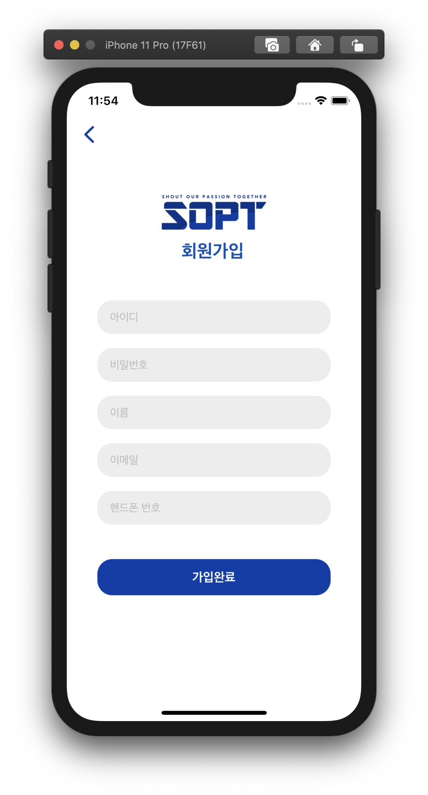

# - 서버통신 by Alamofire 🎉

## 🟢 4차 도전과제 리뷰! 🟢

실행 gifs

 </br>

1. `UserDefault`를 이용한 미니DB 이용하기 - (`CoreData`)
2. `Delegate`를 이용해 VC간 데이터 전달하기 - (`KVO`, `Notification Center`)

## ✏️자동 로그인 설정✏️

### 1. 로그인 성공 시, UserDefault로 저장할 객체는 Id, PassWord, Token입니다.

#### ⭕️ 1. UserDefault

> 사용자의 기본적인 데이터베이스 인터페이스입니다. key와 Value값을 쌍으로 저장합니다. <br>

장점

- 사용하기 편리합니다. <br>
  _삽입_ : `UserDefaults.standard.set()` <br> _삭제_ : `UserDefaults.standard.removeObject()`
- `Signleton`이므로 런타임중 어디서나 접근 가능합니다.
- 다양한 값을 다룰 수 있습니다.

단점.

- 표준 데이터만 저장할 수 있습니다. 커스텀한 Object는 일반적으로 저장할 수 없습니다.
- 앱 실행속도에 영향을 끼칩니다. `UserDefault`는 사용되기 전에 데이터를 모두 동기화해서 로드하므로, DB처럼 사용하는 경우에는 비효율적입니다.

따라서, `UserDefault`에는 필요한 데이터만 적재적소에 사용해야 합니다!
<br><br>

제가 사용한 `BEMCheckBox`는 해당 버튼의 체크 유무를 다음과 같이 구분합니다. `BEMCheckBox.on(off)`
<br>

```swift
if self.autoLoginButton.on {
                    UserDefaults.standard.set(inputID, forKey: "id")
                    UserDefaults.standard.set(inputPWD, forKey: "pwd")
                }


```

로그인 통신이 성공했으며, `autoLoginButton`이 체크된 상황에는 UserDefault에 아이디와 패스워드를 저장합니다.<br>
다음, 저장된 토큰과 `Id`, `PassWord`는 앱이 재 실행될때 다음과 같은 코드를 마주합니다.

```swift

    func autoLogin() {
        if let userId = UserDefaults.standard.string(forKey: "id") {
            let uid = userId
            guard let pwd = UserDefaults.standard.string(forKey: "pwd") else { return }

            autoButtonClick(uid, pwd)
        }
    }

```

`id`라는 key값이 존재하면 앱이 실행될 때 위와같은 함수가 실행됩니다. 키값이 없으면 실행되지 않습니다. <br>
`CocoaPods`등 버튼 세팅과 위 함수를 `ViewDidLoad()`에 위치시키면 정상적으로 자동 로그인을 할 수 있습니다. <br>

실행되는 함수 `autoButtonClick(~)`은 이어서 설명하겠습니다! <br><br>

## ✏️회원가입 뒤 자동으로 로그인 구현✏️

#### ⭕️ 2. Delegate

다른 객체간 함수의 전달 방법은 여러가지가 있지만 (`Notification Center`, `KVO`), Delegate를 이용하여 <br> 객체간 정보 전달을 완성해보겠습니다!

Delegate는 다음과 같은 특징을 가지고 있습니다.

- `protocol`로 구현할 것
- 대신 처리하는 객체 - A, 처리를 시키는 객체 B 두 객체로 구성

내용이 조금 어려울 수 있으나, **A**는 하청을 받는 객체, **_B_** 는 하청을 시키는 객체!간의 관계라는 점!<br>

 

왼쪽 : 하청을 받는 **A**, 오른쪽 : 하청을 시키는 **_B_**

**_B_** 의 회원가입을 누르면, **A** 객체가 일을 받아서 로그인 버튼을 눌러야 하기 때문입니다.

가장 먼저, 두 객체간 연결다리를 할 `Delegate`를 선언합니다.

```swift
protocol signUpAndAutoLoginDelegate {
    func autoButtonClick(_ id: String, _ pwd: String)
}
```

예상컨데, **_B_** 객체에서 위 함수를 통해 `id`와 `pwd`를 넘겨줄 것입니다.

```swift
A Controller : UIViewController, signUpAndAutoLoginDelegate {

}
```

위와 같이 `A Controller`에서 `signUpAndAutoLoginDelegate`를 채택합니다. 필수적으로 구현해야 하는 함수는

```swift
func autoButtonClick(_ id: String, _ pwd: String)
    {
        txtFields[0].text = id
        txtFields[1].text = pwd
        loginButton.sendActions(for: .touchUpInside)
    }
```

입니다. 따라서 **_B_** 객체를 통해 받아온 id, pwd로 `LoginButton`에 접근하게 됩니다. <br>
전체적인 흐름은 위와 같습니다. 틀린 개념이 있거나, 모르는 것이 있다면 언제든지 말씀해 주세요!
